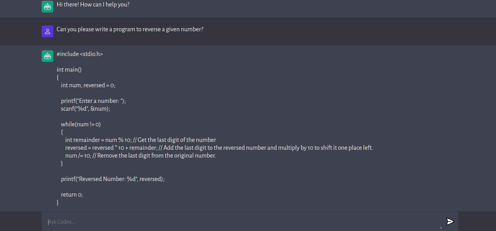

# Open AI Codex

It is a simple Web Application similar to Chat GPT which can be used as a Chat bot to get answers to various questions entered by the users.

The source code of this application is built using **Reactjs** which is present [here](https://github.com/muskanmi/open-ai-codex/tree/master/client) and the backend is created using **Nodejs** which is present [here](https://github.com/muskanmi/open-ai-codex/tree/master/server).


***Note:*** This application actually makes use of various APIs provided by Open AI to get the answers to the questions entered by the users and is neither an exact replica of it nor is associated with it directly.




## Tools & Technology Used:

- React.js
- Node.js
- Express.js
- HTML
- CSS
- Javascript
- Web APIs


## Prerequisites:

* React Version: **18.2.0**
* Node Version: **18.14.1**
* NPM Version: **9.5.0**
* You need to be registered with the OpenAI platform and have an API key generated in your account to access APIs provided by Open AI.


## Instructions:

1. Get the source code of the application on your pc via git.

    ```shell
    git clone https://github.com/muskanmi/open-ai-codex.git
    ```

2. Now, you first need to start the backend server before running the frontend server. So, navigate inside the folder containing the source code of the backend of application through your terminal:

    ```shell
    cd server
    ```

3. Next, before running the backend server, you need to add the value of your OpenAI API key in the `.env` file as follows:

    ```js
    OPENAI_API_KEY=""
    ```

4. Then, install the required dependencies by running the following command:

    ```shell
    npm install
    ```

5. Finally, start the application by running:

    ```shell
    npm start
    ```

6. After following the above instructions, your backend server would start running at [http://127.0.0.1:5000/](http://127.0.0.1:5000/) (if this port is not being consumed by some other running application).

7. Now, you can start the frontend server by navigating inside the respective folder containing the source code of the frontend of this application through another terminal session:

    ```shell
    cd client
    ```

8. Install the required dependencies for frontend application by executing the following command:

    ```shell
    npm install
    ```

9. Finally, start the frontend server by running:

    ```shell
    npm run dev
    ```

10. Voila! the application is ready for use. You can access it at [http://127.0.0.1:3000/](http://127.0.0.1:3000/) (if this port is not being consumed by some other running application).


#### :small_blue_diamond: Please do give a ⭐️ if you find this project useful.
